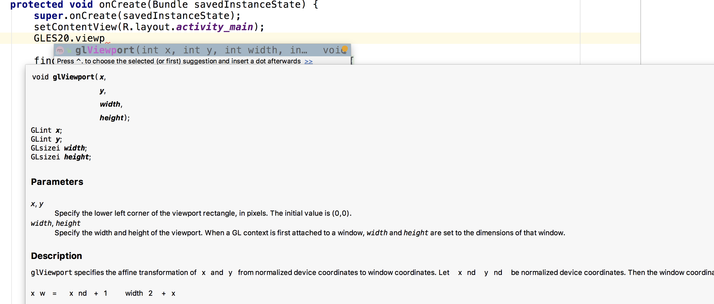

xjavadoc
========

xjavadoc stand for eXtra Javadoc, bring extra javadoc support for Android studio.

Currently added javadoc

* gles and egl

Installation
------

* **STEP1**, Build the plugin project or download the release version [xjavadoc-1.0-SNAPSHOT.jar](release/xjavadoc-1.0-SNAPSHOT.jar)
```sh
$ ./gradlew jar
```
* **STEP2**, Install `xjavadoc-1.0-SNAPSHOT.jar` to Android Studio

`Preferences` -> `Plugins` -> `Install Plugin from disk...`

* **STEP3**, Restart IDE, run the plugin via `Tools` -> `Add extra javadoc support...`

* **SETP4**, Restart IDE again to reload the modified configuration

* **STEP5**, Uninstall this plugin if you don't need it in the future

* **SETP6**, Enjoy Open GLES coding with documentation support

__NOTE__: You need to re-run this plugin if you update your Android Stdio, because the configuration will be updated when update Android Stdio

Here is a screenshot of my environment



This plugin finally create a file `$ANDROID_SDK_ROOT/docs/android-gles-javadoc.jar` and add javadoc entries to `jdk.table.xml` under tag `javaDocPath`, also add some debug and error log to `idea.log`. These three files might helpful for diagnostic if your encounter wired issue while using this plugin.

Installation manually
------

If you don't trust all the steps the plugin do above for you, you can download the finally generated file [android-gles-javadoc.jar](release/android-gles-javadoc.jar) and modify `jdk.table.xml` by adding entries refer to this javadoc under xml tag `javadocPath`. And restart IDE to take effect.

Motivation behind this project
------
Android Studio has great documentation support for Android API, but not Open GLES.

This project try to make use Open GLES api in Android Studio more easily.

Below is the extra work need to do for this project, read it if you want to add more documentation or want to improve some poor documentation in Android Studio. It's not always the same, but it might give you some clues to accomplish your works.

1. Get a text or html version of javadoc
   
   For OpenGL ES related document, refer to [Khronos github page](https://github.com/KhronosGroup), for EGL document, refer to [EGL-Registry](https://github.com/KhronosGroup/EGL-Registry).
   This project only add GLES 2.0 and EGL documentation, but other GLES version documentation can be easily added.
   
   After get the source xml, then use the command below to create a javahelp version of the document in Linux
   
   ```sh
   for xml in *.xml
   do 
       xsltproc /usr/share/xml/docbook/stylesheet/docbook-xsl/javahelp/javahelp.xsl $xml && mv -vf index.html ${xml//.xml}.html
   done
   ```
   
   For `brew` users in macOS, install `docbook-xsl` firstly, 
   ```sh
   $ brew install docbook-xsl
   ```
   Then run the `xsltproc` command like above by specifying stylesheet path to `$(brew --prefix)/Cellar/docbook-xsl/1.79.1/docbook-xsl/javahelp/javahelp.xsl`
   
   The stylesheet for `htmlhelp` version `docbook-xsl/htmlhelp/htmlhelp.xsl` also work fine, the generated files for `javahelp` version and `htmlhelp` version are almost identical.

2. Use [jsoup](https://jsoup.org/) to generate a version of javadoc that Android studio support

   That means removing tags that the inline javadoc viewer can not handle

3. Use [javaparser](https://github.com/javaparser/javaparser) to map javadoc to the source code

   Every method in java source can find a javahelp html file generated in step 1
   
4. Use `javadoc` command to generate javadoc, this step will output as a javadoc jar version

5. Integrate the generated javadoc jar in step 4 into the IDE

   Add an javadoc entry in IDE configuration file `jdk.table.xml`, the path of this file is different on different OS.
   
   * For macOS, if Android Studio version is 3.4, location is `$HOME/Library/Preferences/AndroidStudio3.4/options/jdk.table.xml
`
   
   This configuration path get updated every time you update Android Studio, so re-run this plugin to make the change take effect.
   
6. Restart Android studio to make all the changes take effect.

Reference resource
------
* [GLES doc from KhronosGroup](https://github.com/KhronosGroup/OpenGL-Refpages)
* [EGL doc from KhronosGroup](https://github.com/KhronosGroup/EGL-Registry)
* [docbook-xsl at SourceFroge](https://sourceforge.net/projects/docbook/files/docbook-xsl/)
* [IntelliJ plugin docs](http://www.jetbrains.org/intellij/sdk/docs/welcome.html)

License
--------
Licensed under the Apache License, Version 2.0 (the "License");
you may not use this file except in compliance with the License.
You may obtain a copy of the License at

    http://www.apache.org/licenses/LICENSE-2.0

Unless required by applicable law or agreed to in writing, software
distributed under the License is distributed on an "AS IS" BASIS,
WITHOUT WARRANTIES OR CONDITIONS OF ANY KIND, either express or implied.
See the License for the specific language governing permissions and
limitations under the License.
